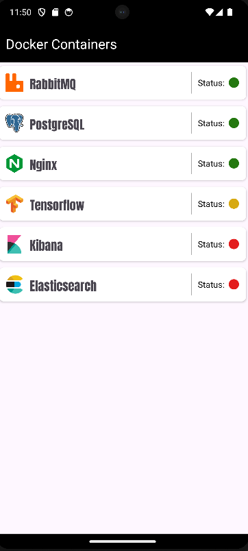
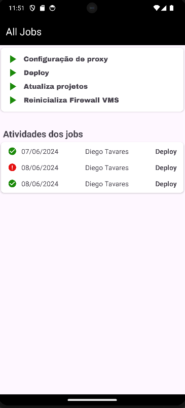
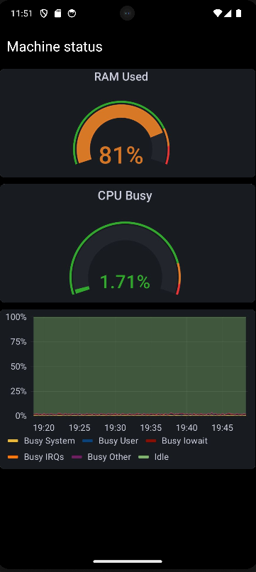
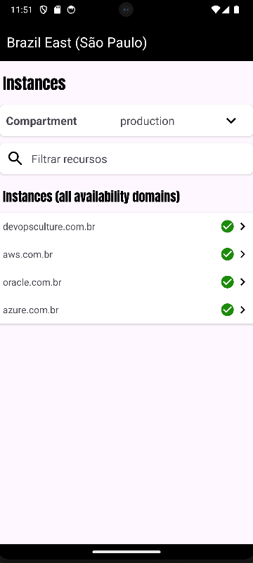

# DevopsCulture

## Descrição

**devopsculture** é uma aplicação estática desenvolvida em Kotlin com o objetivo de unir diversas ferramentas DevOps para facilitar e automatizar processos. As ferramentas integradas incluem Ansible, Docker, Rundeck, GitHub, Grafana e Oracle Cloud Infrastructure (OCI).

## Índice

- [Introdução](#introdução)
- [Funcionalidades](#funcionalidades)
- [Autor](#autor)
- [Agradecimentos](#agradecimentos)
- [Imagens](#imagens)

## Introdução

A cultura DevOps busca a colaboração entre as equipes de desenvolvimento e operações para entregar software de forma mais rápida e eficiente. O **devopsculture** foi desenvolvido como uma aplicação estática para facilitar essa integração, oferecendo uma solução que combina as principais ferramentas usadas no ecossistema DevOps.

## Funcionalidades

- **Automação com Ansible:** Gerenciamento e provisionamento de infraestrutura.
- **Containerização com Docker:** Criação e gerenciamento de contêineres.
- **Orquestração com Rundeck:** Automação de tarefas e processos.
- **Integração com GitHub:** Gestão de código-fonte e CI/CD.
- **Monitoramento com Grafana:** Visualização de métricas e logs.
- **Gerenciamento de Cloud com OCI:** Integração com Oracle Cloud Infrastructure.

## Autor

Diego Tavares - Analista de Infraestrutura Cloud - diegombtavares

## Agradecimentos

Agradeço ao professor [Igor Turto](https://github.com/turtinho) pelas orientações valiosas e pelo suporte no desenvolvimento do projeto **devopsculture**.

## Imagens

Aqui estão capturas de tela da aplicação **devopsculture**:

- **Automação com Ansible:**
  
  
- **Containerização com Docker:**
  
  
- **Orquestração com Rundeck:**
  
  
- **Integração com GitHub:**
  
  
- **Monitoramento com Grafana:**
  
  
- **Gerenciamento de Cloud com OCI:**
  
